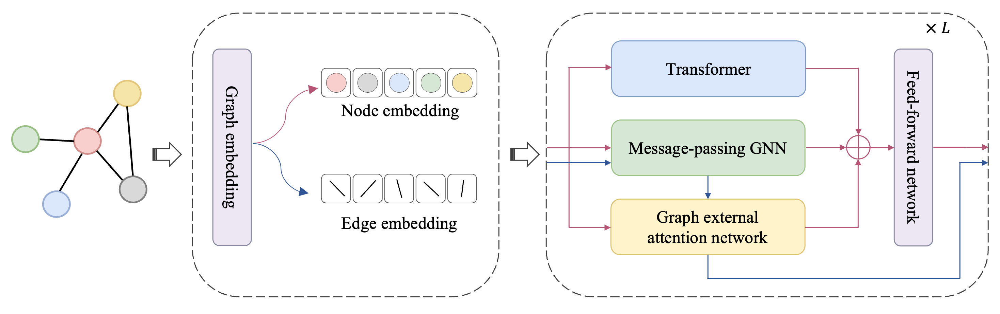
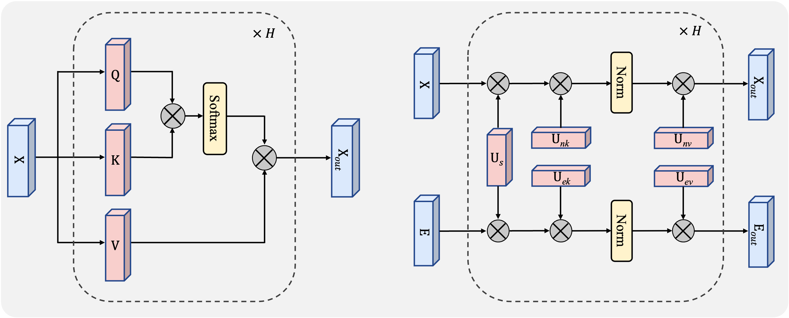

# Graph External Attention Enhanced Transformer


[Proceedings of the 41st International Conference on Machine Learning, PMLR 235:29560-29574, 2024.](https://proceedings.mlr.press/v235/liang24a.html)


GEAET architecture:



Transformer vs GEANet:



> The code implementation is based on [GraphGPS (Rampasek et al., 2022)](https://github.com/rampasek/GraphGPS).

### Python environment setup

```bash
conda create -n GEAET python=3.10
conda activate GEAET

conda install pytorch=1.13 torchvision torchaudio pytorch-cuda=11.7 -c pytorch -c nvidia
conda install pyg=2.2 -c pyg -c conda-forge
pip install pyg-lib -f https://data.pyg.org/whl/torch-1.13.0+cu117.html

# RDKit is required for OGB-LSC PCQM4Mv2 and datasets derived from it.  
conda install openbabel fsspec rdkit -c conda-forge

pip install pytorch-lightning yacs torchmetrics
pip install performer-pytorch
pip install tensorboardX
pip install ogb
pip install wandb

conda clean --all
```


### Running GEAET on Different Datasets
```bash
conda activate GEAET

# Running GEAET on CIFAR10
python main.py --cfg configs/GEAET/CIFAR10.yaml  wandb.use False accelerator "cuda:0"

# Running GEAET on MNIST
python main.py --cfg configs/GEAET/mnist.yaml  wandb.use False accelerator "cuda:0"

# Running GEAET on PATTERN
python main.py --cfg configs/GEAET/pattern.yaml  wandb.use False accelerator "cuda:0"

# Running GEAET on peptides-struct
python main.py --cfg configs/GEAET/peptides-struct.yaml  wandb.use False accelerator "cuda:0"

# Running GEAET on PyG-VOCSuperpixels
python main.py --cfg configs/GEAET/vocsp.yaml  wandb.use False accelerator "cuda:0"

# Running GEAET on PyG-COCOSuperpixels
python main.py --cfg configs/GEAET/coco.yaml  wandb.use False accelerator "cuda:0" 

# replace 'cuda:0' with the device to use
# The above datasets will be downloaded automatically when running the code.

```


## Citation

If you find this work useful, please cite our ICML 2024 paper:
```bibtex
@inproceedings{liang2024graph,
  title={Graph External Attention Enhanced Transformer},
  author={Jianqing Liang and Min Chen and Jiye Liang},
  booktitle={International Conference on Machine Learning},
  year={2024},
}
```
