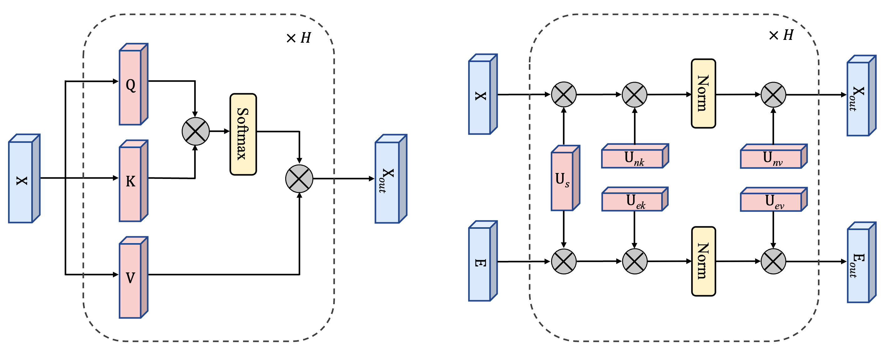

# Graph External Attention Enhanced Transformer

[](https://arxiv.org/abs/2205.12454)

> The code implementation is based on [GraphGPS (Rampasek et al., 2022)](https://github.com/rampasek/GraphGPS).


GEAET architecture:


Transformer vs GEANet:




### Python environment setup with Conda

```bash
conda create -n GEAET python=3.10
conda activate GEAET

conda install pytorch=1.13 torchvision torchaudio pytorch-cuda=11.7 -c pytorch -c nvidia
conda install pyg=2.2 -c pyg -c conda-forge
pip install pyg-lib -f https://data.pyg.org/whl/torch-1.13.0+cu117.html

# RDKit is required for OGB-LSC PCQM4Mv2 and datasets derived from it.  
conda install openbabel fsspec rdkit -c conda-forge

pip install pytorch-lightning yacs torchmetrics
pip install performer-pytorch
pip install tensorboardX
pip install ogb
pip install wandb

conda clean --all
```


### Running GEAET
```bash
conda activate GEAET

# Run
python main.py --cfg configs/GEAET/CIFAR10.yaml  wandb.use False accelerator "cuda:0" 

# replace 'cuda:0' with the device to use
# replace 'CIFAR10.yaml' with any experiments to run

```


## Citation

If you find this work useful, please cite our NeurIPS 2022 paper:
```bibtex
@article{rampasek2022GPS,
  title={{Recipe for a General, Powerful, Scalable Graph Transformer}}, 
  author={Ladislav Ramp\'{a}\v{s}ek and Mikhail Galkin and Vijay Prakash Dwivedi and Anh Tuan Luu and Guy Wolf and Dominique Beaini},
  journal={Advances in Neural Information Processing Systems},
  volume={35},
  year={2022}
}
```
